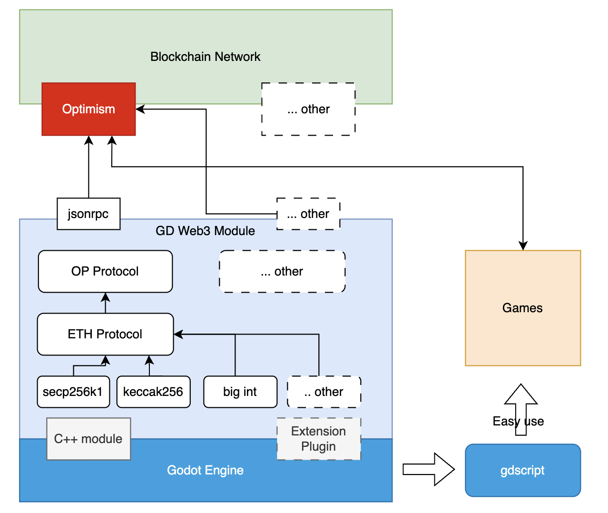

# GDWeb3

GDWeb3 is a GDScript library for interacting with blockchain networks.

Supported Networks：

1. [Optimism](https://www.optimism.io/) (in progress)
2. ...



## Docs
* [en](https://gdweb3-docs.readthedocs.io/en/latest/)
* [简体中文](https://gdweb3-docs-cn.readthedocs.io/zh-cn/latest/index.html)

## Description

GDWeb3 aims to help Godot game developers easily interact with blockchain networks, empowering them to develop Gamefi and FOCG (full on-chain games).

However, supporting all blockchain networks at once is not feasible. At this stage, our primary focus is on the Optimism Network. Optimism's performance as an ETH Layer 2 solution is excellent, and it has a strong ecosystem. We believe that supporting a network with promising development will attract game developers to continue building.

We believe that the unique creativity and boundless ideas of game developers will accelerate the development of the web3 gaming industry. Being able to provide assistance to them and, perhaps one day, play enjoyable FOCG games is the joy we find in maintaining this project.

## About Godot Engine

Godot Engine is a feature-packed, cross-platform game engine that allows users to create 2D and 3D games from a unified interface. It provides a comprehensive set of common tools, allowing users to focus on making games without reinventing the wheel. Games can be exported with one click to various platforms, including major desktop platforms (Linux, macOS, Windows), mobile platforms (Android, iOS), web-based platforms, and consoles.

Godot is completely free and open source under the permissive MIT license. Users' games belong to them, down to the last line of engine code. Godot's development is fully independent and community-driven, empowering users to shape the engine to match their expectations. It is supported by the Godot Foundation, a not-for-profit organization.

## Support Godot Version

At this stage, we are developing based on `4.3-stable` version. Currently, we only guarantee upward compatibility. Therefore, when you use the program compiled from this project to extend development on older game projects, please pay attention to the version number of the Godot engine program you originally used.

## Getting Started

The project is developed using the basic capabilities of Godot Engine's custom C++ modules.

[Custom C++ Modules](https://docs.godotengine.org/en/stable/contributing/development/core_and_modules/custom_modules_in_cpp.html)

Based on this capability, we can directly use C++ to implement code without worrying about the performance loss of using GDScript. At the same time, game developers can also use GDScript directly, and the underlying code will eventually be displayed in GDScript.

> Thanks to the Godot team for their excellent work!

Since GDWeb3 has not yet been merged into the main branch of Godot (this may become possible in the future), you need to recompile the engine or use our precompiled engine program.

### Compiling from Source

#### 1. Setup Godot Engine compilation environment
[Building from Source](https://docs.godotengine.org/en/stable/contributing/development/compiling/index.html)

You can refer to this tutorial to set up your own Godot Engine compilation environment. Trust me, it's unbelievably simple! Definitely worth a try!

#### 2. Clone our project
```
git clone https://github.com/qingfengzxr/gdscript-web3.git
```

#### 3. Copy web3 module
Copy web3 directory into Godot Engine project's modules directory.

```
cp -rf ~/gdscript-web3/modules/web3 ~/godot/modules
```
> Don't forget to replace your own path

#### 4. Install gmp library
ubuntu:
```
sudo apt install libgmp-dev
```

Also, it is can be install by source code. Reference: https://gmplib.org/

#### 5. Compile Godot Engine
Linux:
```
scons platform=linuxbsd
```

MacOS:
```
scons platform=osx arch=arm64
```


### Using the Released Version
The latest version is `v0.0.2-alpha`.

>However, it is not production-ready yet. We will expedite the process as soon as possible.

## SDK Usage Introduction
TODO

## Example Project
1.[HelloOptimism](https://github.com/qingfengzxr/HelloOptimism)
2.[TetrisDemo](https://github.com/hallazie/TetrisDemo)
